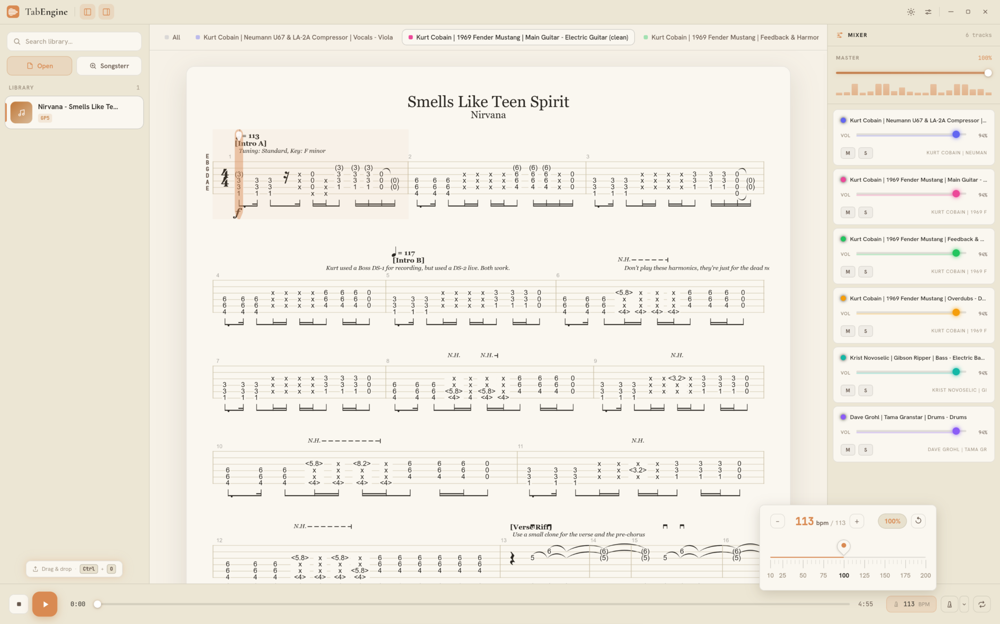
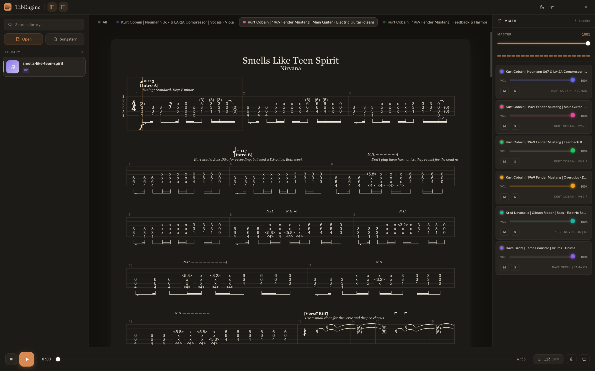

<p align="center">
  
</p>

A desktop guitar tab player. Drop in a Guitar Pro file (GP3, GP4, GP5, GPX) and you're playing — no account, no ads, no install-a-launcher, no "upgrade to premium" wall.

## Why this exists

We all got tired of Songsterr. Features that used to be free ended up behind a paywall, including things that run entirely client-side, and the experience kept getting worse while there wasn't a real alternative to switch to. So I built one.

TabEngine is free, and it's staying that way — no paywalled updates, no premium tier, ever. It's licensed under **GPLv3** specifically so nobody can fork it, slap a price tag on it, and ship it as a closed-source product. If anyone improves it, that improvement stays free for everyone too.

## What it does

- Opens GP3 / GP4 / GP5 / GPX files and renders synced tab + standard notation, powered by [alphaTab](https://www.alphatab.net/)
- Real mixer — per-track volume, mute, solo, pan
- Loop sections, metronome, and tempo shifting for the parts you need to slow down
- Works fully offline once you have a file
- No local file? Search and pull tabs straight from [Songsterr](https://www.songsterr.com/) without leaving the app

## Screenshots

<p>
  
  
</p>

## Good to know

- **This is an early project** — functional day-to-day, but still rough around the edges. Expect some bugs.
- **Songsterr browsing will break.** TabEngine talks to Songsterr's site directly, and they change things on their end without warning. When that happens, browsing/fetching will stop working until I patch it — it's outside my control, but I'll fix it as fast as I can.
- **Copyrighted tabs won't load directly.** Songsterr restricts some songs from being fetched programmatically. For those, grab the file yourself via [songsterr-downloader.vercel.app](https://songsterr-downloader.vercel.app/) and open it in TabEngine like any local file.
- **TabEngine isn't affiliated with, endorsed by, or in any way connected to Songsterr.** It just talks to their public site to fetch tabs, same as your browser would.

Found a bug or something feels broken? Open an issue. Want to fix it yourself? PRs are very welcome.

## Installation notes

Prebuilt binaries (Windows, macOS, Linux) are attached to each [release](../../releases). They're built by GitHub Actions and are **unsigned** — I don't pay for a Windows code-signing certificate or an Apple developer account ($99/year), so your OS will flag the app as coming from an unverified developer. This is expected; here's how to get past it:

- **Windows (`.exe`)** — SmartScreen will show "Windows protected your PC." Click **More info** → **Run anyway**.
- **macOS (`.dmg`)** — Gatekeeper will block the app as from an unidentified developer. Right-click the app in Applications and choose **Open**, or clear the quarantine flag manually:
  ```bash
  xattr -cr /Applications/TabEngine.app
  ```
- **Linux (`.AppImage`)** — no signing required. Just mark it executable and run it:
  ```bash
  chmod +x TabEngine.AppImage
  ```

## Building from source

```bash
npm install        # installs deps, also copies alphaTab's runtime assets into public/
npm run tauri dev   # starts the real app: Vite + the Tauri window
```

A few other scripts, if you need them:

```bash
npm run dev    # just the Vite dev server, no Tauri window — useful for quick UI iteration
npm run build  # type-checks then builds for production
npm run check  # svelte-check, run this before committing any .svelte changes
```

## How it's built

- **Frontend** — Svelte 4 + TypeScript, with [alphaTab](https://www.alphatab.net/) doing the heavy lifting for rendering and audio playback.
- **Backend** — Rust via [Tauri 2](https://v2.tauri.app/). All filesystem access (reading/saving/scanning tabs) and the Songsterr network calls happen here, not in the webview.

Tauri keeps the app small — no Electron/Chromium bundled in, just your OS's native webview.

## License

[GPLv3](LICENSE) — free forever, and any derivative work has to stay free too.

<p align="center">
  <a href="https://www.codefactor.io/repository/github/scrimas/tabengine"></a>
  <a href="https://deepwiki.com/Scrimas/TabEngine"></a>
</p>
